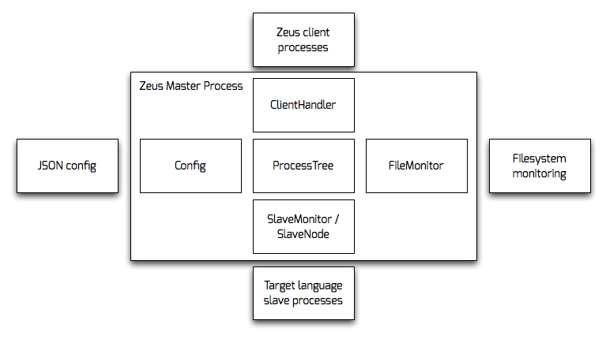

# Zeus Overview

Zeus is composed of three components:

1. The Master Process. This is written in Go, and coordinates all the other processes. It connects Clients to Slaves and handles reloading when files change.

2. Clients. The Client is also written in Go. It sends a command to the Master, and has its streams wired up to a Command process, to make it appear to be running locally.

3. Slaves/Commands. These are the target application. A small shim, written in the target language, manages the communication between the application and the Master process, and boots the application in phases.

See: [`terminology.md`](terminology.md)

## Master Process

### Logical Modules

1. Config

2. ClientHandler

3. FileMonitor

4. SlaveMonitor

The Master process revolves around the `ProcessTree` -- the core data structure that maintains most of the state of the application. Each module performs most of its communication with other modules through interactions with the Tree.

### 1. Config

This component reads the configuration file on initialization, and constructs the initial `ProcessTree` for the rest of the application to use.

### 2. ClientHandler

The `ClientHandler` listens on a socket for incoming requests from Client processes, and negotiates connections to running Slave processes. It is responsible for interactions with the client for its entire life-cycle.

### 3. FileMonitor

The `FileMonitor`'s job is to restart slaves when one of their dependencies has changed. Slaves are expected to report back with a list of files they have loaded. The `FileMonitor` listens for these messages and registers them with an external process that watches the filesystem for changes. When the external process reports a change, the `FileMonitor` restarts any slaves that have loaded that file.

### 4. SlaveMonitor

This component is responsible for communication with the target-language shim to manage booting and forking of application phase slaves. It constantly attempts to keep all slaves booted, restarting them when they are killed or die.

See also: [`master_slave_handshake.md`](master_slave_handshake.md)

## Client Process

The client process is mostly about terminal configuration. It opens a PTY, sets it to raw mode (so that 'fancy' commands behave as if they were running locally), and passes the slave side of the PTY to the Master process.

The client then sets up handlers to write STDIN to the PTY, and write the PTY's output to STDOUT. STDIN is scanned for certain escape codes (`^C`, `^\`, and `^Z`), which are sent as signals to the remote process to mimic the behaviour of a local process.

A handler is set up for SIGWINCH, again to forward it to the remote process, and keep both window sizes in sync.

When the remote process exits, it reports its exit status, which the client process then exits with.

See also: [`client_master_handshake.md`](client_master_handshake.md)

## Slave/Command Processes

The Slave processes boot the actual application, and run commands. See [`master_slave_handshake.md`](master_slave_handshake.md), and the ruby implementation in the `rubygem` directory.